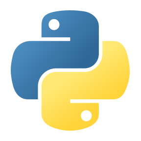
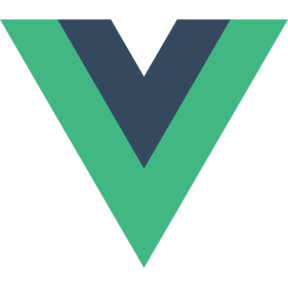
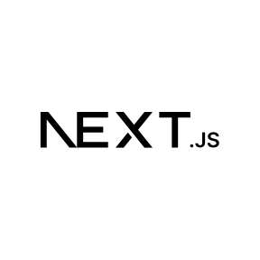
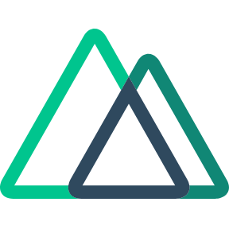
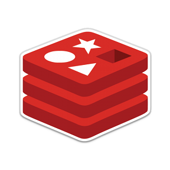
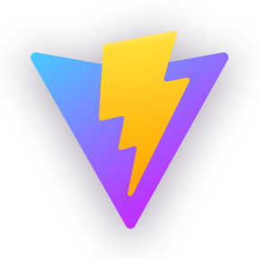
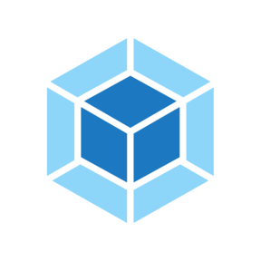
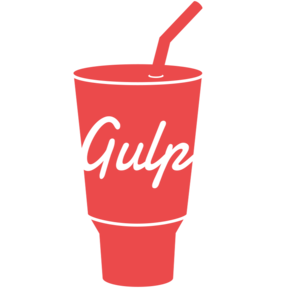
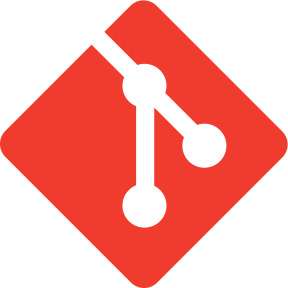

# Hi, I'm [Shenzhepei](https://github.com/shenzhepei) 👋

English | [中文](./README.zh-CN.md)

A front-end developer focused on web development, front-end engineering, and practical tools.

- 🔭 Exploring more efficient and reliable front-end development workflows
- 🌱 Deepening my knowledge of TypeScript, modern front-end frameworks, and Node.js
- 💡 I enjoy turning ideas into simple, useful products
- 💬 Feel free to start a conversation through [Issues](https://github.com/shenzhepei/shenzhepei/issues)

---

### Languages

  <code></code>
  <code></code>
  <code></code>
  <code></code>
  <code></code>
  <code></code>
  <code></code>
  <code></code>

### Frameworks & Tools

  <code></code>
  <code></code>
  <code></code>
  <code></code>
  <code></code>
  <code></code>
  <code></code>
  <code></code>
  <code></code>
  <code></code>
  <code></code>
  <code></code>
  <code></code>
  <code></code>
  <code></code>
  <code></code>
  <code></code>
  <code></code>
  <code></code>
  <code></code>

### Code Editor

  <code></code>
  <code></code>

### AI

  <code></code>
  <code></code>
  <code></code>

